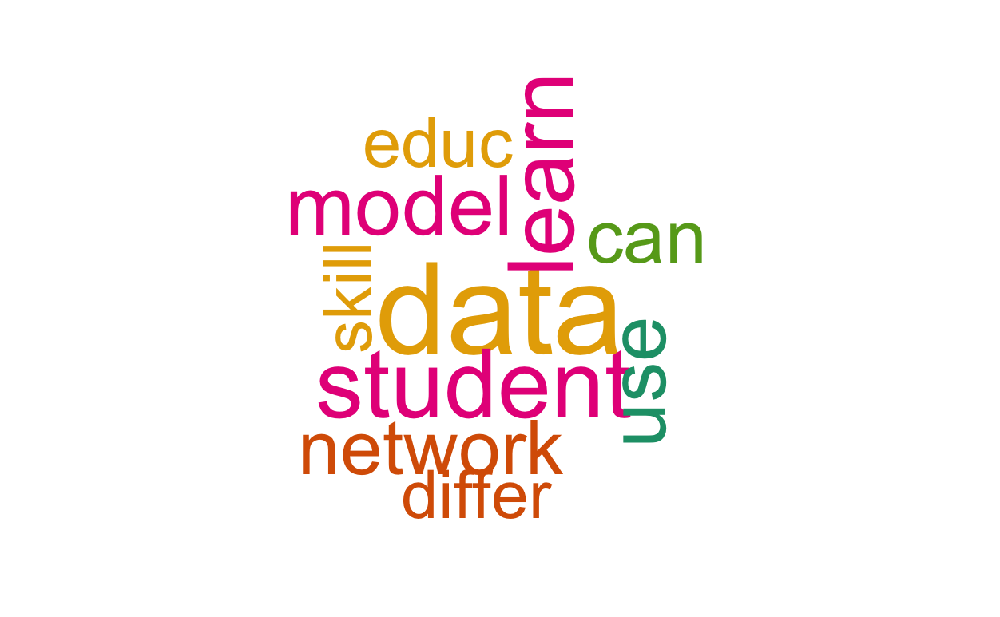
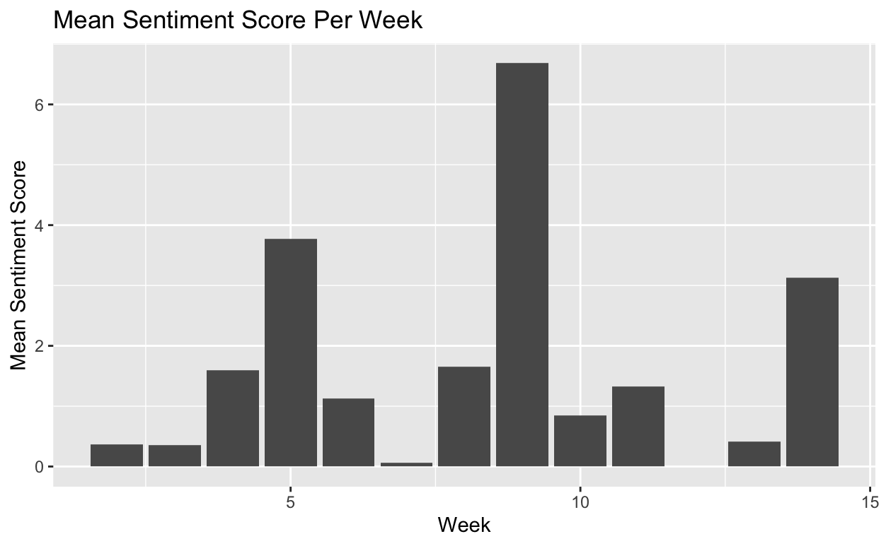

# Natural Language Processing

The use of natural language processing has exploded over the last decade. Applications that require machines to understand natural human speech patterns are abundant and substantial improvements in these systems has increased their utility. Within the educational space NLP is used to interpret human speech for the prupose of understanding human problems and recently an online tutor passed a limited version of the [Turing Test](https://en.wikipedia.org/wiki/Turing_test) when it was [indistinguishable from teaching assistants in a college class](http://www.news.gatech.edu/2017/01/09/jill-watson-round-three).

## Goals for this unit

* Apply pre-processing to text data 
* Apply simple sentiment analysis to a set of documents
* Apply a latent dirichlet allocation to a set of documents

## Data 

* Week-list.csv ; corpus 1 
* positive-words.txt ; positive lexicon for sentiment analysis 
* negative-words.txt ; negative lexicon for sentiment analysis 

## Overview

This project explores three core areas of NLP procedures. First, a set of documents is pre-processed for analysis. Next, positively and negatively-valenced lexicons are brought into the environment to run sentiment analysis. Finally, this project uses Latent Dirichlet Allocation (LDA) for topic modeling. 

 

 

